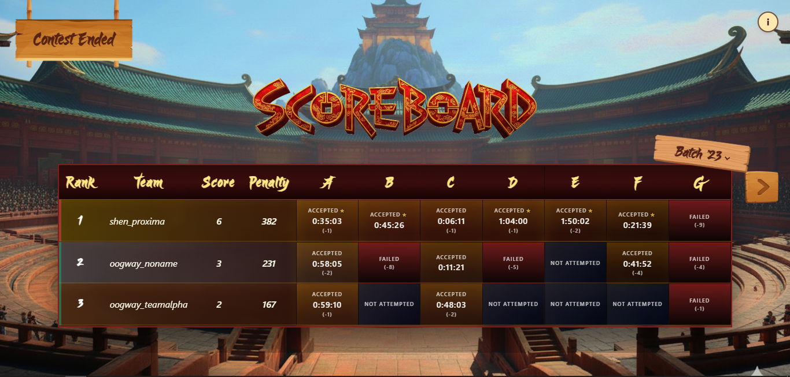
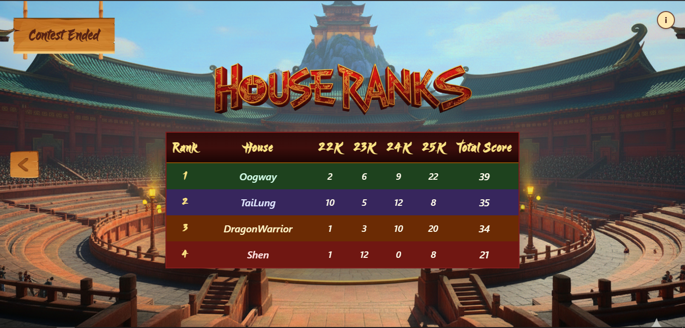
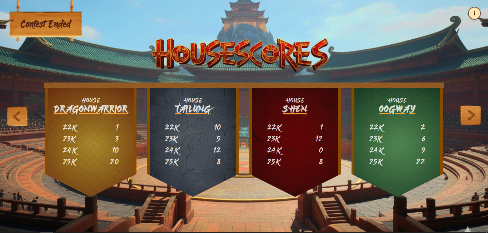

# 🐼 Coders Cup '25 Scoreboard

<div align="center">
  
  
  
</div>

## About The Project

A real-time scoreboard system built for **ACM Coders' Cup '25**, themed around Kung Fu Panda! This project provides live rankings and statistics for competitive programming module of Coders' Cup teams across all four batches, with house-wise rankings and points tracking.

The system automatically scrapes data from **VJudge**, processes it through a robust backend, and delivers instant updates to a dynamic frontend through WebSocket connections - ensuring you never miss a moment of the action!

##  Features

-  **Live Team Rankings** - Real-time display of team standings across all four batches
-  **House-Wise Rankings** - Track performance by house affiliation
-  **House Points Tracking** - Monitor accumulated points for each house
-  **WebSocket Integration** - Instant live updates without page refresh
-  **Automated Data Scraping** - Continuous data collection from VJudge
-  **Kung Fu Panda Theme** - Immersive UI inspired by the beloved franchise

## Tech Stack

### Frontend (Client)
- **React** - Modern UI library for building interactive interfaces
- **TypeScript** - Type-safe JavaScript
- **Vite** - Next-generation frontend tooling
- **WebSocket Client** - Real-time communication

### Backend (Server)
- **Express.js** - Fast, minimalist web framework for Node.js
- **WebSocket** (Socket.io/ws) - Real-time bidirectional communication
- **Node.js** - JavaScript runtime

### Scraping Script
- **Node.js** - JavaScript runtime for automation

## Project Structure

```
coderscup-scoreboard-2025/
│
├── client/          # React Frontend Application
│   ├── src/
│   │   ├── components/    # Reusable UI components
│   │   ├── pages/         # Page-level components
│   │   └── utils/         # Helper functions and utilities
│   └── public/
│
├── server/          # Express.js Backend
│   └── src/
│       ├── routes/        # API endpoints
│       ├── middleware/    # Auth and other middleware
│       └── bufferController/  # Data buffering logic
│
└── script/          # VJudge Scraping Script
    └── main.js            # Main scraping logic
```

## 🖼️ Screenshots

### Live Scoreboard

*Real-time team rankings across batches*

### House Rankings

*House-wise performance tracking*

### House Statistics

*Detailed points and statistics by house*


## Getting Started

### Prerequisites

- Node.js (v14 or higher)
- npm or yarn package manager

### Installation

1. **Clone the repository**
   ```bash
   git clone https://github.com/yourusername/coderscup-scoreboard-2025.git
   cd coderscup-scoreboard-2025
   ```

2. **Install Frontend Dependencies**
   ```bash
   cd client
   npm install
   ```

3. **Install Backend Dependencies**
   ```bash
   cd ../server
   npm install
   ```

4. **Install Scraping Script Dependencies**
   ```bash
   cd ../script
   npm install
   ```

### Running the Application

1. **Start the Backend Server**
   ```bash
   cd server
   npm start
   ```

2. **Start the Frontend (in a new terminal)**
   ```bash
   cd client
   npm run dev
   ```

3. **Run the Scraping Script (in a new terminal)**
   ```bash
   cd script
   npm start
   ```

The application will be running at `http://localhost:5173` (or the port specified in your Vite config).

## How It Works

1. **Data Scraping**: The script in the `script/` folder continuously scrapes team and submission data from VJudge
2. **Backend Processing**: Scraped data is posted to the Express.js backend, which processes and stores it
3. **Real-Time Updates**: The backend establishes WebSocket connections with frontend clients
4. **Live Display**: When new data arrives, it's instantly pushed to all connected clients, updating the scoreboard in real-time

## Contributing

This project was built for ACM Coders Cup '25. If you'd like to improve this project or have any questions about the codebase, feel free to:

- Open an issue
- Submit a pull request
- Reach out directly at **abdullahazharkhan1@gmail.com**

## Contact

**Abdullah Azhar Khan**  
📧 Email: abdullahazharkhan1@gmail.com

